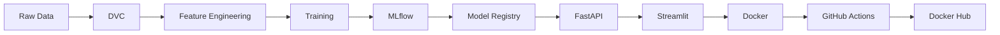

# 🩺 CycleSense

**Menstrual Cycle Prediction & Pattern Intelligence**

An explainable machine-learning system that learns from a user's profile and previous menstrual-cycle history to estimate their next cycle length and analyze patterns influencing that prediction.

## ⚠️ Medical Disclaimer

**CycleSense provides data-driven cycle estimates for educational demonstration and pattern exploration. Predictions are estimates and should not be used for diagnosis, contraception, fertility planning, or medical decisions.**

---

## 🎯 Problem

People's cycle lengths vary and simple fixed-calendar assumptions do not capture individual historical patterns. CycleSense uses machine learning to provide personalized estimates based on:

- User profile (age, BMI, lifestyle factors)
- Historical cycle patterns
- Current cycle information
- Lifestyle and stress factors

## 📊 Dataset

- **User Profiles**: 2,000 users with demographic and lifestyle information
- **Cycle Logs**: 17,976 cycle records with detailed measurements
- **Total Features**: 34 columns after joining datasets

### Key Features

**User Profile:**
- Age, BMI, diet quality, exercise frequency
- Sleep hours, caffeine intake, water intake
- Alcohol consumption, smoking status
- Birth control use, PCOS diagnosis
- Baseline stress score

**Cycle Log:**
- Cycle length, previous cycle length
- Cycle phase, flow level, pain level
- PMS symptoms, mood score
- Stress score, sleep hours, energy level
- Hormonal measurements (estrogen, progesterone)
- Overall health score, log consistency

## 🏗️ Architecture



## 🔬 Feature Engineering

### 1. Historical Cycle Features (Leakage-Safe)

**Lag Features:**
- `cycle_length_lag_1`, `cycle_length_lag_2`, `cycle_length_lag_3`

**Rolling Statistics:**
- `cycle_length_mean_last_3`, `cycle_length_std_last_3`
- `cycle_length_mean_last_5`, `cycle_length_std_last_5`
- `cycle_length_min_last_3`, `cycle_length_max_last_3`

**Change Features:**
- `cycle_length_change`, `cycle_length_abs_change`

### 2. Profile Features (Static, Always Available)

- Age, BMI, lifestyle factors
- Baseline stress score
- Birth control use, PCOS diagnosis

### 3. Cross-Source Features

**Delta Features:**
- `stress_delta = stress_score_cycle - stress_score_baseline`
- `sleep_delta = sleep_hours_cycle - sleep_hours`

**Interaction Features:**
- `stress_sleep_interaction`

### 4. Date Features

- Month, quarter, day_of_year
- Cyclical representations: `month_sin`, `month_cos`

## 🚫 Leakage Prevention

**Feature Categorization:**

- **SAFE_AT_PREDICTION_TIME** (14 features): Available when making prediction
- **CONDITIONAL** (10 features): Depends on prediction timing
- **EXCLUDED_LEAKAGE** (6 features): Not available at prediction time
- **IDENTIFIER_ONLY** (4 features): For grouping only

**Strict Feature Set:** Only information realistically available before/at prediction time

**Extended Feature Set:** Includes conditional features, still excludes direct target leakage

## 📈 Model Experiments

### Baselines

1. **Baseline Mean**: Predict global training-set mean (MAE: 1.94 days)
2. **Previous Cycle**: Predict next cycle ≈ current cycle (MAE: 2.30 days)

### ML Models

| Model | MAE (days) | RMSE (days) | R² | Training Time |
|-------|-----------|-------------|----|----------------|
| Linear Regression | 1.74 | 2.24 | 0.266 | 0.16s |
| Ridge | 1.74 | 2.24 | 0.266 | 0.03s |
| Lasso | 1.94 | 2.62 | -0.006 | 0.03s |
| Random Forest | 1.73 | 2.21 | 0.284 | 3.08s |
| **Gradient Boosting** | **1.70** | **2.18** | **0.306** | **0.45s** |

**Best Model:** Histogram-based Gradient Boosting (MAE: 1.70 days)

**Improvement over baselines:**
- +10.3% improvement over baseline mean
- +26.0% improvement over previous cycle baseline

## 🔍 Feature Importance

**Top Features by Permutation Importance:**
1. `pcos_diagnosed` (0.250)
2. `cycle_length_mean_last_5` (0.126)
3. `cycle_length_mean_last_3` (0.022)
4. `bmi` (0.013)
5. `birth_control_use` (0.008)

## 🔄 MLOps Pipeline

### Data Versioning (DVC)
- Tracks raw datasets (Period_Log.csv, User_Profile.csv)
- Reproducible data pipeline
- Version-controlled transformations

### Experiment Tracking (MLflow)
- Tracks all model experiments
- Logs hyperparameters, metrics, artifacts
- Model comparison and selection

### Model Registry
- Registered model: `CycleSenseCycleLengthModel`
- Version management
- Promotion workflow (Staging → Production)

### Quality Gates
- MAE threshold: 2.5 days
- R² threshold: 0.2
- Automatic promotion criteria

## 🚀 API (FastAPI)

**Endpoints:**
- `GET /health` - Health check
- `GET /model-info` - Model information
- `POST /predict` - Prediction endpoint
- `GET /metrics` - API metrics

**Prediction Request:**
```json
{
  "profile": {
    "age": 28,
    "bmi": 22.8,
    "diet_quality": "Good",
    ...
  },
  "cycle_history": {
    "cycle_length_days": 28.0,
    "prev_cycle_length": 27.0,
    ...
  },
  "historical_cycles": [28, 29, 27, 28, 30]
}
```

**Prediction Response:**
```json
{
  "predicted_next_cycle_length_days": 28.4,
  "model_version": "1.0",
  "prediction_type": "educational_estimate"
}
```

## 🖥️ Streamlit Dashboard

**Pages:**
- **Dashboard**: Overview and health status
- **Predict Next Cycle**: Interactive prediction form
- **Pattern Insights**: Historical cycle analysis
- **Model Insights**: Model performance and explainability
- **About**: Project documentation

## 🐳 Docker

**Build:**
```bash
docker build -t cyclesense .
```

**Run:**
```bash
docker run -p 8000:8000 -p 8501:8501 cyclesense
```

**Access:**
- FastAPI: http://localhost:8000
- Streamlit: http://localhost:8501
- API Docs: http://localhost:8000/docs

## 🔄 CI/CD (GitHub Actions)

**Workflow:**
1. Checkout code
2. Setup Python environment
3. Install dependencies
4. Run tests (pytest)
5. Build Docker image
6. Login to Docker Hub
7. Push Docker image

**Environment Variables:**
- `DOCKERHUB_USERNAME`
- `DOCKERHUB_TOKEN`

## 📁 Project Structure

```
cyclesense/
├── api/
│   ├── __init__.py
│   ├── main.py          # FastAPI application
│   └── schemas.py       # Pydantic models
├── ui/
│   └── streamlit_app.py # Streamlit dashboard
├── src/
│   ├── __init__.py
│   ├── config.py        # Configuration
│   ├── data.py          # Data loading
│   ├── data_profile.py  # EDA and profiling
│   ├── target.py        # Target construction
│   ├── leakage_audit.py # Leakage analysis
│   ├── features.py      # Feature engineering
│   ├── preprocessing.py # Preprocessing pipeline
│   ├── train.py         # Model training
│   └── evaluate.py      # Evaluation and explainability
├── scripts/
│   ├── promote_model.py # Model promotion workflow
│   └── retrain.py       # Retraining workflow
├── monitoring/
│   └── drift.py         # Drift detection
├── data/
│   ├── raw/             # Raw datasets (DVC tracked)
│   ├── processed/       # Processed data
│   └── reference/       # Reference data for drift
├── artifacts/
│   ├── model.joblib     # Trained model
│   ├── model_metadata.json
│   └── feature_importance.json
├── reports/
│   ├── figures/         # Visualizations
│   ├── data_profile.md
│   ├── leakage_audit.md
│   ├── split_strategy.md
│   └── model_report.md
├── tests/               # Unit and integration tests
├── .github/workflows/
│   └── ci-cd.yml        # GitHub Actions
├── Dockerfile
├── entrypoint.sh
├── requirements.txt
├── .gitignore
├── .dockerignore
└── README.md
```

## 🛠️ Local Setup

### Prerequisites
- Python 3.9+
- Git
- Docker (optional)

### Installation

```bash
# Clone repository
git clone <repository-url>
cd cyclesense

# Create virtual environment
python3 -m venv venv
source venv/bin/activate  # On Windows: venv\Scripts\activate

# Install dependencies
pip install -r requirements.txt

# Prepare data
cp /path/to/Period_Log.csv data/raw/
cp /path/to/User_Profile.csv data/raw/

# Run data profiling
python src/data_profile.py

# Train models
python src/train.py

# View MLflow UI
mlflow ui

# Start API
uvicorn api.main:app --reload

# Start Streamlit (in another terminal)
streamlit run ui/streamlit_app.py
```

## 🧪 Testing

```bash
# Run all tests
pytest

# Run with coverage
pytest --cov=src --cov=api
```

## 📊 MLflow Commands

```bash
# Start MLflow UI
mlflow ui

# View experiments
# Open http://localhost:5000 in browser

# Promote model
python scripts/promote_model.py
```

## 🔄 DVC Commands

```bash
# Initialize DVC
dvc init

# Track data
dvc add data/raw/Period_Log.csv
dvc add data/raw/User_Profile.csv

# Reproduce pipeline
dvc repro
```

## 📈 Monitoring

### Drift Detection
- Statistical comparison with reference data
- KS test for numerical features
- Distribution comparison for categorical features

### Metrics
- Prediction count
- Error count
- Average latency
- Model version

## 🔄 Retraining

```bash
# Run retraining workflow
python scripts/retrain.py
```

**Workflow:**
1. Load new data
2. Validate and preprocess
3. Train candidate model
4. Evaluate against champion
5. Promote if quality gate passes

## 🎓 Learning Outcomes

This project demonstrates:

1. **Feature Engineering**: Leakage-safe temporal features, rolling statistics, interaction terms
2. **Leakage Prevention**: Rigorous audit of prediction-time availability
3. **Model Selection**: Baseline comparison, multiple algorithms, hyperparameter tuning
4. **MLOps**: DVC, MLflow, model registry, promotion workflows
5. **Production**: FastAPI, Streamlit, Docker, CI/CD
6. **Monitoring**: Drift detection, metrics tracking
7. **Explainability**: SHAP values, permutation importance

## 🔬 Key Engineering Decisions

### Why GroupShuffleSplit?
- Prevents data leakage by keeping all cycles of a user together
- More realistic than random row splitting
- Ensures temporal integrity

### Why MAE?
- Expresses error directly in days
- Intuitive interpretation: "MAE of 1.7 days means predictions differ from observed next-cycle length by 1.7 days on average"
- More interpretable than RMSE for stakeholders

### Why Scaling for Linear Models but not Tree Models?
- Linear models (Ridge, Lasso) are sensitive to feature scale
- Tree-based models (Random Forest, Gradient Boosting) are scale-invariant
- Applied scaling only where needed for optimization

### Why Separate Preprocessing and Model?
- Ensures training and production use identical transformations
- Prevents training-production divergence
- Reproducible feature pipeline

### Why DVC instead of Git?
- Git versions code while DVC tracks large datasets
- Prevents repository bloat
- Links exact dataset version to training pipeline
- Enables data reproducibility

### Why MLflow?
- Centralized experiment tracking
- Model versioning and registry
- Hyperparameter comparison
- Artifact management

### Why FastAPI + Streamlit?
- FastAPI: Production-grade API for inference
- Streamlit: Rapid UI development for demonstration
- Separation of concerns: API handles ML, UI handles visualization

### Why Docker?
- Consistent environment across development and production
- Simplifies deployment
- Reproducible builds
- Isolates dependencies

## 🚧 Limitations

1. **Educational Dataset**: Based on synthetic educational data, not real patient data
2. **Not Medical Advice**: Should not replace professional medical care
3. **Simplified Features**: Real-world applications would need more sophisticated features
4. **No Real-time Updates**: Model requires retraining for new patterns
5. **Limited External Factors**: Doesn't account for medications, health conditions, etc.

## 🚀 Future Improvements

1. **Real-world Data**: Integration with actual health data sources
2. **Advanced Features**: More sophisticated temporal features, external factors
3. **Uncertainty Estimation**: Prediction intervals, confidence bounds
4. **Multi-task Learning**: Predict additional outcomes (symptoms, mood)
5. **Explainability**: Local explanations for individual predictions
6. **Deployment**: Cloud deployment (AWS EC2, Azure, GCP)
7. **Monitoring**: Real-time drift detection, performance monitoring
8. **User Feedback**: Continuous learning from user corrections

## 📚 References

- Feature Engineering Course Mind Map
- MLflow Documentation
- DVC Documentation
- FastAPI Documentation
- Streamlit Documentation

## 👥 Team

Built as a comprehensive ML/MLOps educational project demonstrating end-to-end machine learning system development.

## 📄 License

Educational and demonstration purposes only.

---

**Built with ❤️ for learning and demonstration**
